# 🏘️ SiKampung Joyotakan - Sistem Informasi & Pelayanan Warga

<!-- Tech Stack Badges -->
<p align="center">
  
  
  
  
  
  
</p>

<p align="center">
  <a href="#-fitur--kelebihan-web">Fitur Utama</a> •
  <a href="#️-cara-menjalankan-aplikasi">Panduan Instalasi</a> •
  <a href="#-panduan-login-pengguna-akun-demo">Akun Demo</a> •
  <a href="#-sistem-manajemen">Sistem Manajemen</a> •
  <a href="#-screenshot-halaman-aplikasi">Antarmuka</a> •
  <a href="#-rancangan-database-erd-diagram">Struktur Database</a>
</p>

---

**SiKampung Joyotakan** adalah platform digital berbasis web yang dirancang khusus untuk memfasilitasi pelaporan keluhan warga serta manajemen data kependudukan secara efisien di Kelurahan Joyotakan. Sistem ini mempertemukan warga secara langsung dengan jajaran admin kelurahan untuk mempercepat penanganan masalah lingkungan, sosial, maupun infrastruktur.

---

## ✨ Fitur & Kelebihan Web

Sistem Informasi SiKampung didesain dengan prinsip kemudahan penggunaan (*user-friendly*) serta tampilan yang premium dan responsif:

1. **Autentikasi Praktis Tanpa Ribet**:
   * **Warga**: Cukup masuk menggunakan 16-digit **NIK (Nomor Induk Kependudukan)** tanpa perlu mengingat password rumit.
   * **Admin**: Masuk secara cepat menggunakan **PIN** rahasia yang aman.
2. **Statistik Real-time**: Beranda menampilkan statistik terkini laporan warga (Total Laporan, Laporan Diproses, dan Laporan Selesai).
3. **Form Pengaduan Interaktif**: Pengaduan dilengkapi dengan judul, lokasi, deskripsi rinci, serta lampiran foto bukti.
4. **Pencarian & Validasi Pintar**: Baik warga maupun admin dapat melakukan pencarian laporan dan memfilter laporan berdasarkan status (Semua, Pending, Proses, Selesai).
5. **Manajemen Akun Warga Terpadu (CRUD)**: Admin memiliki kendali penuh untuk menambah, mengedit (secara inline tanpa pindah halaman), serta menghapus akun warga secara instan.
6. **Desain Modern & Responsif**: Menggunakan Tailwind CSS dengan ornamen batik modern khas Nusantara, navigasi menu hamburger pada tampilan ponsel, serta dialog/toast interaktif yang memanjakan mata.

---

## 🛠️ Cara Menjalankan Aplikasi

Ikuti panduan langkah demi langkah di bawah ini untuk menjalankan platform di komputer lokal Anda:

### Prerequisites (Prasyarat)
* **Laragon** atau **XAMPP** (PHP >= 8.2 & MySQL)
* **Composer**
* **Node.js & NPM**

### Langkah Instalasi

1. **Clone & Masuk ke Folder Project**:
   ```bash
   git clone https://github.com/cece1329/sikampung-web.git
   cd sikampung
   ```

2. **Instal Dependensi PHP**:
   ```bash
   composer install
   ```

3. **Salin File Konfigurasi `.env`**:
   ```bash
   cp .env.example .env
   ```

4. **Generate Application Key**:
   ```bash
   php artisan key:generate
   ```

5. **Konfigurasi Database di `.env`**:
   Sesuaikan baris-baris berikut dengan setelan database lokal Anda (misalnya Laragon):
   ```env
   DB_CONNECTION=mysql
   DB_HOST=127.0.0.1
   DB_PORT=3306
   DB_DATABASE=sikampung
   DB_USERNAME=root
   DB_PASSWORD=root
   ```

6. **Migrasi Database dan Seed Data Awal**:
   Perintah ini akan membuat semua tabel yang dibutuhkan dan mengisi data akun uji coba untuk warga dan admin:
   ```bash
   php artisan migrate:fresh --seed
   ```

7. **Menghubungkan Storage Link**:
   Agar file foto keluhan warga dapat tampil di halaman web, buat symbolic link untuk direktori storage:
   ```bash
   php artisan storage:link
   ```

8. **Jalankan Aplikasi**:
   ```bash
   php artisan serve
   ```
   Buka peramban (browser) Anda lalu akses url **`http://127.0.0.1:8000`**.

---

## 🔑 Panduan Login Pengguna (Akun Demo)

Untuk keperluan pengujian, sistem telah menyediakan akun demo default berikut setelah Anda menjalankan seeder:

### 1. Login sebagai Warga (Citizen)
* **Halaman Login**: Akses menu **Masuk** di pojok kanan atas beranda atau langsung ke `http://127.0.0.1:8000/login`.
* **Kredensial**:
  * **NIK**: `1234567890123456`
* **Hak Akses**: Warga dapat membuat laporan pengaduan baru, melihat status pengaduan pribadi, dan mencari/memfilter riwayat laporan di halaman profil mereka.

### 2. Login sebagai Admin Kelurahan
* **Halaman Login**: 
  * **Cara 1 (URL)**: Masuk langsung via URL khusus admin di `http://127.0.0.1:8000/admin/login`.
  * **Cara 2 (Shortcut Rahasia)**: Pada Halaman Utama (Beranda), ketik kata **`joyo`** langsung di keyboard Anda. Sistem akan mendeteksi ketukan tersebut dan langsung mengarahkan Anda ke Halaman Login Admin secara otomatis!
* **Kredensial**:
  * **PIN**: `123456`
* **Hak Akses**: Admin dapat mengakses dashboard kelurahan, mengubah status laporan (Proses ➔ Selesai), menghapus laporan, serta mengelola data kependudukan warga (Tambah, Edit, dan Hapus Warga).

---

## 💼 Sistem Manajemen

### 📈 Manajemen Pengaduan (Laporan)
Setiap keluhan warga melewati tiga tahap status yang dikendalikan oleh Admin Kelurahan:
1. **Pending**: Laporan baru masuk dan menunggu peninjauan admin.
2. **Proses**: Laporan sedang ditindaklanjuti oleh petugas kelurahan di lapangan.
3. **Selesai**: Laporan telah sukses ditangani dan diselesaikan. Warga menerima notifikasi visual yang melegakan.

### 👥 Manajemen Warga (CRUD Penduduk)
Admin kelurahan dapat melakukan manajemen data kependudukan:
* **Tambah Warga**: Menambahkan nama, NIK (16 digit), RT, dan RW. Secara otomatis sistem akan mengeset password awal dan PIN warga sama dengan NIK mereka.
* **Edit Warga**: Mengubah data profil warga secara langsung di tabel daftar warga melalui form inline editor yang dinamis.
* **Hapus Warga**: Menghapus data akun warga yang sudah tidak terdaftar di kelurahan.

---

## 📸 Screenshot Halaman Aplikasi

Berikut adalah tampilan visual antarmuka dan struktur database dari aplikasi **SiKampung Joyotakan**:

### 💻 Tampilan Desktop / Laptop (Responsive Web)

#### 1. Halaman Beranda (Landing Page)
Menampilkan statistik keluhan warga secara real-time dengan latar belakang batik modern khas Nusantara.
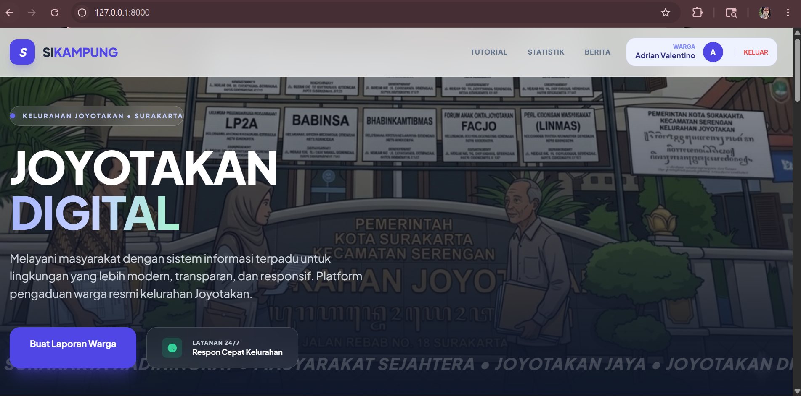

#### 2. Form Kirim Pengaduan Baru
Formulir pengaduan interaktif bagi warga untuk mengirim laporan keluhan beserta lokasi dan unggah foto bukti.
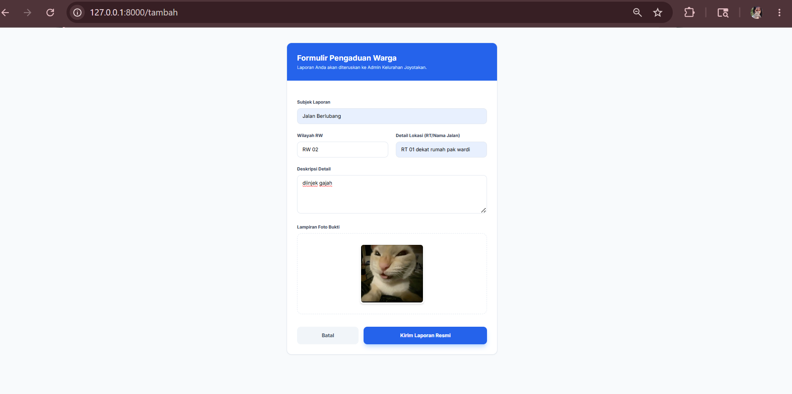

#### 3. Halaman Login Warga
Halaman login warga yang sangat praktis, cukup menggunakan 16 digit NIK.
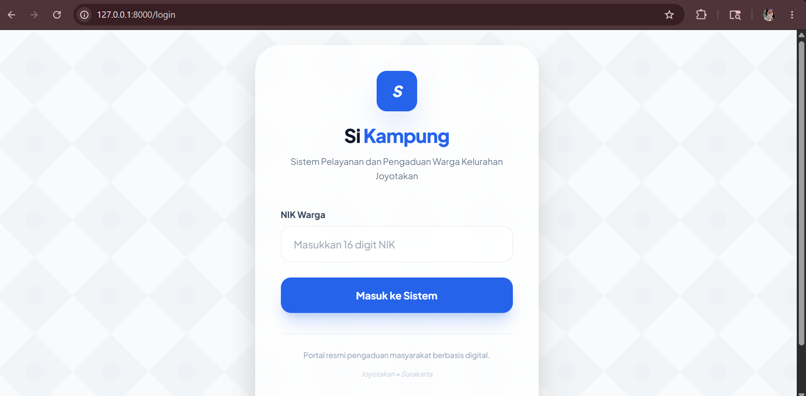

#### 4. Halaman Login Admin
Halaman login khusus bagi administrator kelurahan dengan sistem input PIN.
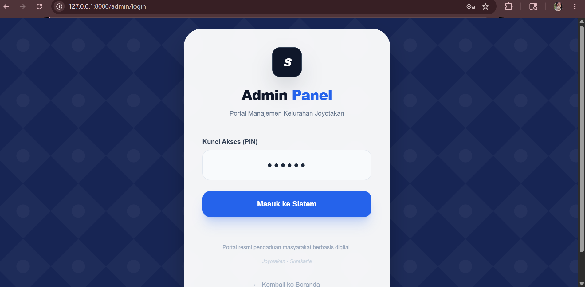

#### 5. Dashboard Administrator Kelurahan
Pusat kontrol admin untuk memantau, memfilter, mencari, serta mengubah status keluhan warga secara dinamis.
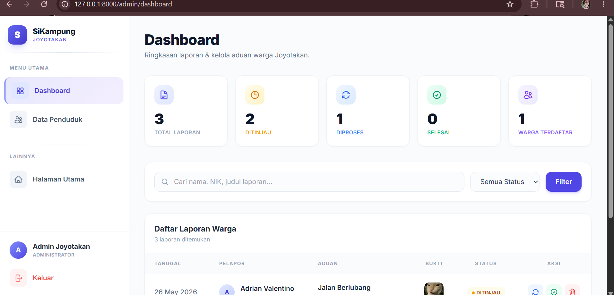

#### 6. Data Penduduk / Manajemen Warga (CRUD Warga)
Halaman admin untuk mengelola (Tambah, Edit secara inline, dan Hapus) data warga terdaftar.
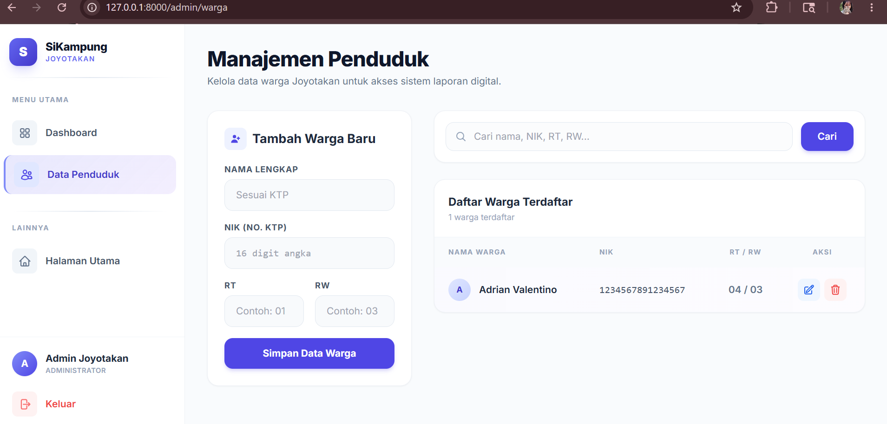

#### 7. Statistik Laporan Warga (Live Data)
Bagian beranda yang menampilkan data statistik terintegrasi untuk total aduan, proses, dan selesai.
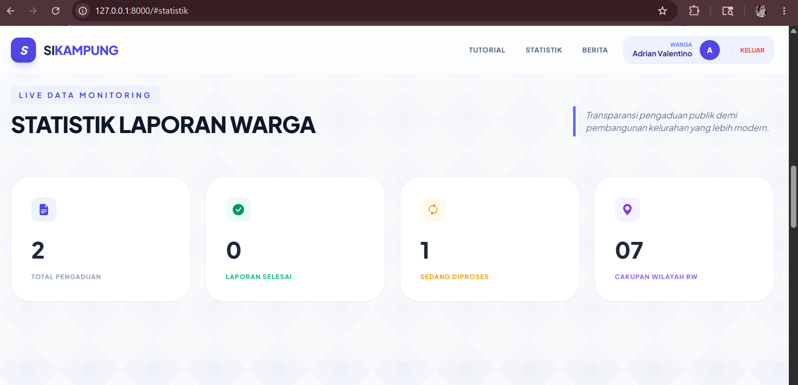

#### 8. Panduan Penggunaan (Tutorial)
Langkah-langkah mudah bagi warga untuk melaporkan aduan mereka.
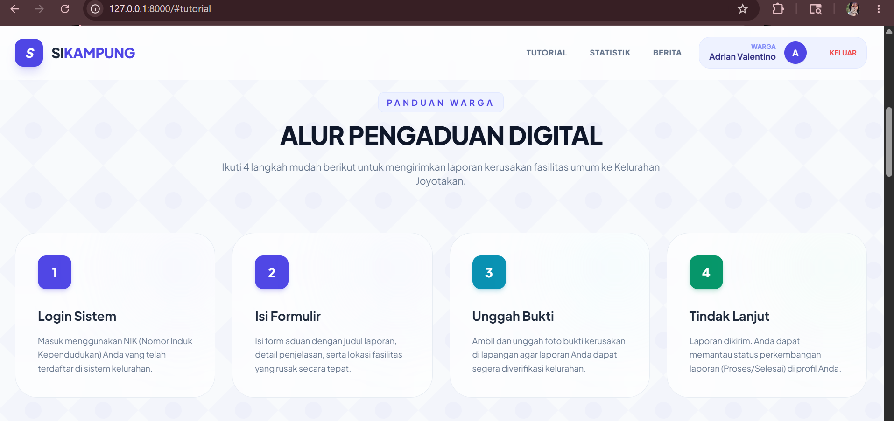

#### 9. Warta Terkini (Berita Kelurahan)
Informasi berita terkini seputar kegiatan di Kelurahan Joyotakan.
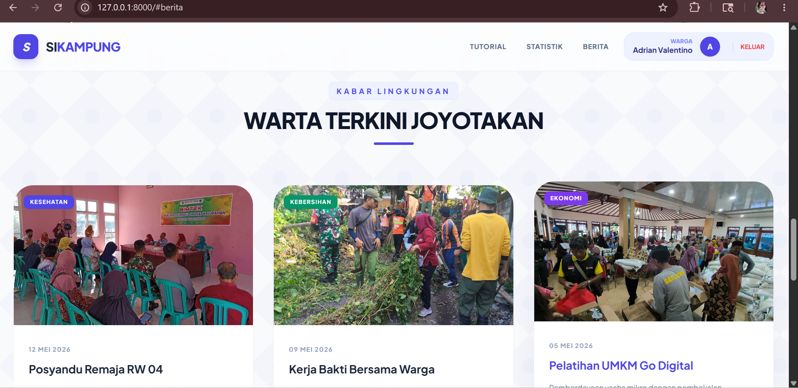

#### 10. Toast Notifikasi Sukses
Toast notification interaktif ketika warga berhasil mengirim aduan baru.
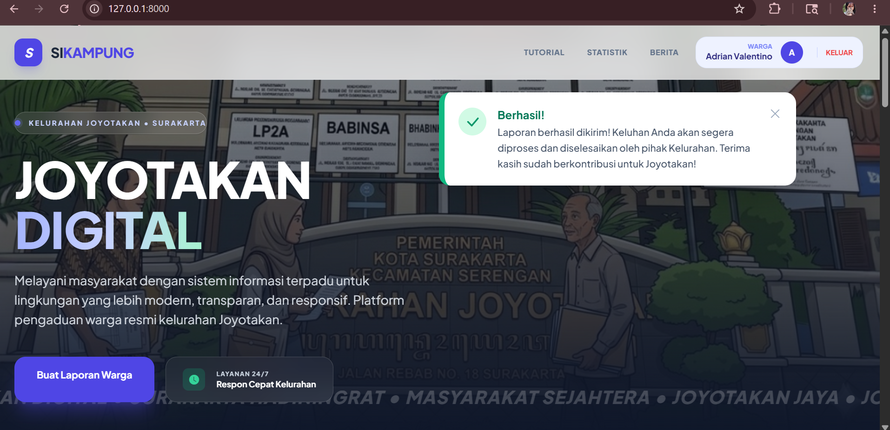

#### 11. Profil & Riwayat Laporan Warga
Halaman profil warga yang menampilkan detail identitas beserta daftar riwayat pengaduan yang pernah dikirimkan.
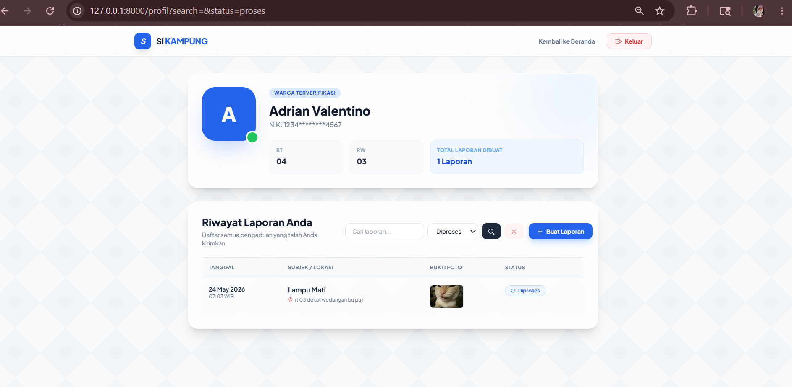

#### 12. Footer Website
Footer lengkap dengan peta lokasi kelurahan, jam operasional, info kontak, serta tautan ke media sosial resmi kelurahan.
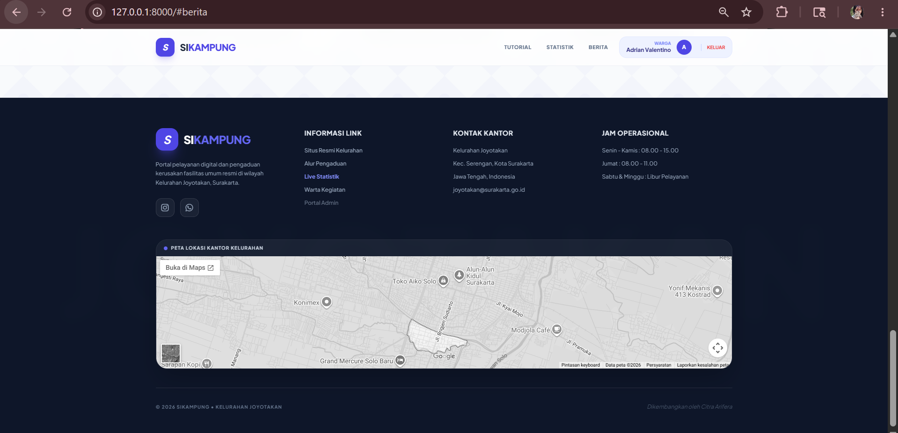

---

### 📱 Tampilan Mobile App (Responsive View)

Tampilan aplikasi ketika diakses melalui perangkat seluler (smartphone) dengan tata letak menu hamburger, layout ringkas, dan toast yang responsif.

<table width="100%">
  <tr>
    <td width="50%" align="center">
      <h4>1. Beranda Mobile</h4>
      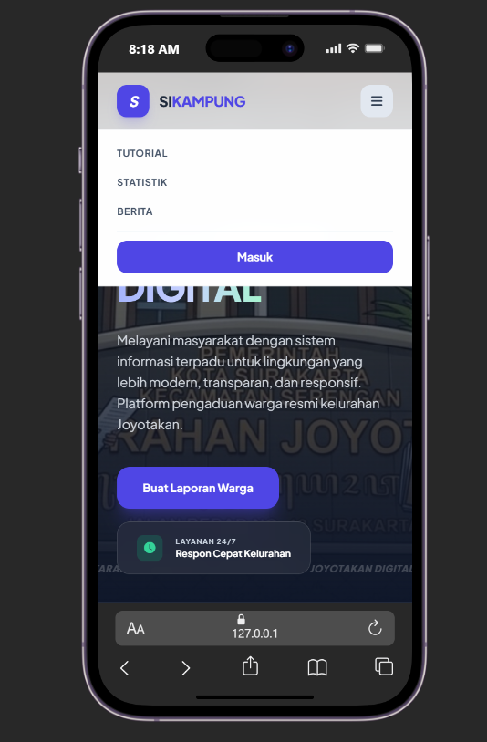
    </td>
    <td width="50%" align="center">
      <h4>2. Login Warga Mobile</h4>
      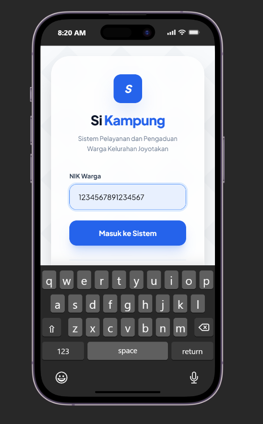
    </td>
  </tr>
  <tr>
    <td width="50%" align="center">
      <h4>3. Profil Warga Mobile</h4>
      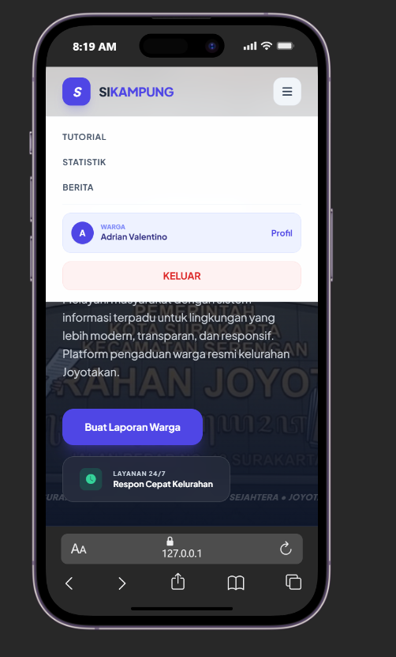
    </td>
    <td width="50%" align="center">
      <h4>4. Riwayat Laporan Mobile</h4>
      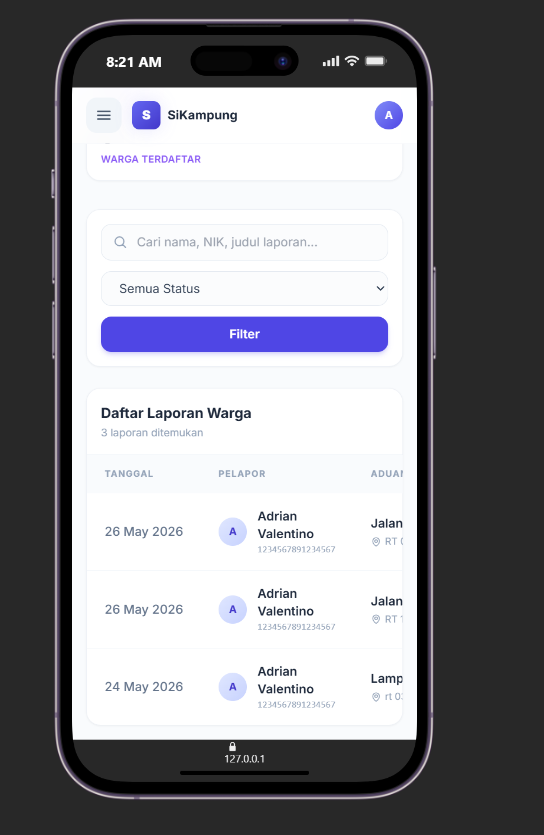
    </td>
  </tr>
  <tr>
    <td width="50%" align="center">
      <h4>5. Form Laporan Mobile</h4>
      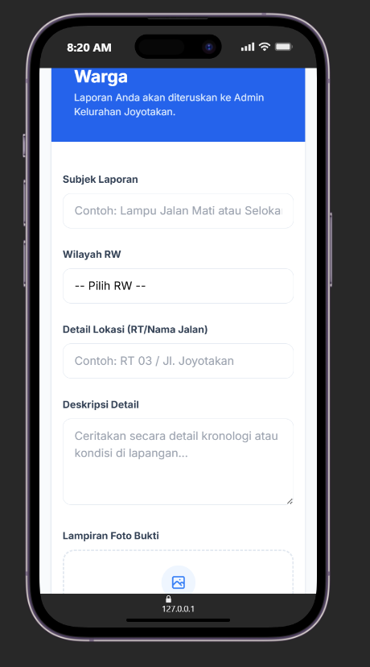
    </td>
    <td width="50%" align="center">
      <h4>6. Dashboard Admin Mobile</h4>
      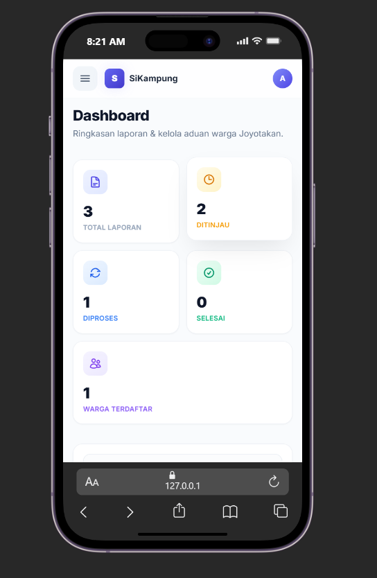
    </td>
  </tr>
  <tr>
    <td width="50%" align="center">
      <h4>7. Side Panel Admin Mobile</h4>
      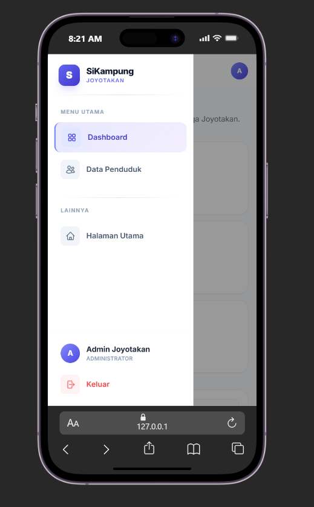
    </td>
    <td width="50%" align="center">
      <h4>8. Data Penduduk Mobile</h4>
      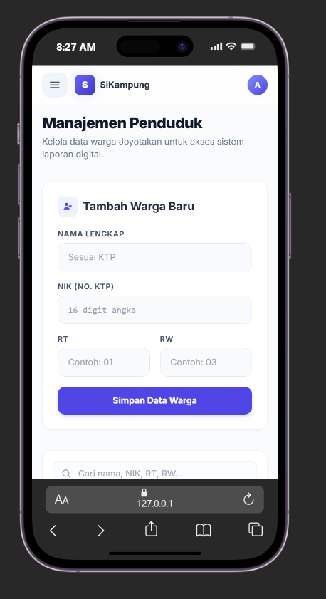
    </td>
  </tr>
</table>

---

### 🗄️ Rancangan & Struktur Database

Sistem ini didukung oleh basis data relasional dengan efisiensi relasi one-to-many antara tabel warga (`users`) dan pengaduan (`laporans`).

#### 1. Entity Relationship Diagram (ERD) / Rancangan Database
Rancangan tabel utama dan relasinya secara visual.


#### 2. Detail Struktur Tabel `users`
Menyimpan data akun admin kelurahan serta data warga terdaftar.
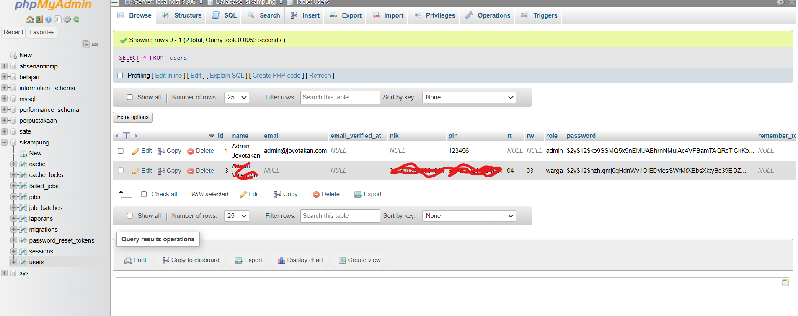

#### 3. Detail Struktur Tabel `laporans`
Menyimpan seluruh pengaduan warga kelurahan beserta status penanganannya.
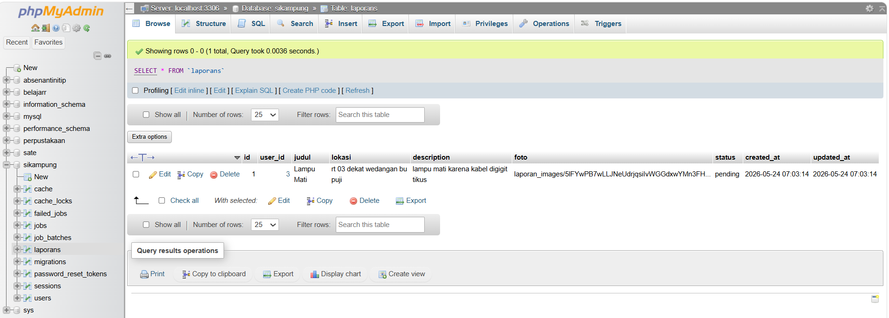

#### 4. Detail Struktur / Indeks Tambahan
Pratinjau detail struktur tabel dan indeks yang terdaftar pada database sistem.
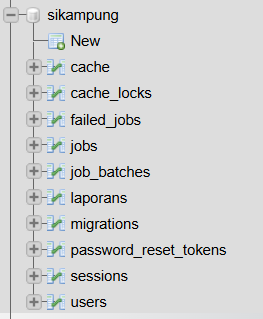

#### 5. Detail Tipe Data & Spesifikasi Kolom
Berikut adalah tabel spesifikasi teknis mengenai tipe data (`BIGINT`, `VARCHAR`, `TEXT`, `ENUM`, `TIMESTAMP`, dll.) yang digunakan pada tabel utama sistem:

##### A. Tabel `users` (Menyimpan data admin & warga)
| Nama Kolom | Tipe Data | Atribut / Keterangan |
| :--- | :--- | :--- |
| `id` | `BIGINT UNSIGNED` | Primary Key, Auto Increment, unik untuk setiap pengguna |
| `name` | `VARCHAR(255)` | Nama lengkap warga atau admin |
| `email` | `VARCHAR(255)` | Alamat email (Unik, Nullable) |
| `email_verified_at`| `TIMESTAMP` | Waktu verifikasi email (Nullable) |
| `nik` | `VARCHAR(255)` | Nomor Induk Kependudukan 16 digit (Unik, Nullable) |
| `pin` | `VARCHAR(255)` | Kode PIN rahasia untuk masuk admin (Nullable) |
| `rt` | `VARCHAR(5)` | Rukun Tetangga (Nullable) |
| `rw` | `VARCHAR(5)` | Rukun Warga (Nullable) |
| `role` | `ENUM('admin', 'warga')` | Peran pengguna dalam sistem (Default: `'warga'`) |
| `password` | `VARCHAR(255)` | Hash password keamanan akun |
| `remember_token` | `VARCHAR(100)` | Token sesi untuk fitur "Remember Me" (Nullable) |
| `created_at` | `TIMESTAMP` | Waktu pembuatan baris data (Nullable) |
| `updated_at` | `TIMESTAMP` | Waktu perubahan baris data terakhir (Nullable) |

##### B. Tabel `laporans` (Menyimpan keluhan/aduan warga)
| Nama Kolom | Tipe Data | Atribut / Keterangan |
| :--- | :--- | :--- |
| `id` | `BIGINT UNSIGNED` | Primary Key, Auto Increment, unik untuk setiap laporan |
| `user_id` | `BIGINT UNSIGNED` | Foreign Key ke `users(id)`, berelasi secara *cascade* jika pengguna dihapus |
| `judul` | `VARCHAR(255)` | Judul singkat keluhan warga |
| `lokasi` | `VARCHAR(255)` | Lokasi spesifik tempat terjadinya keluhan |
| `description` | `TEXT` | Deskripsi detail keluhan dari warga |
| `foto` | `VARCHAR(255)` | Nama file/path foto bukti keluhan yang diunggah (Nullable) |
| `status` | `ENUM('pending', 'proses', 'selesai')` | Status penanganan aduan (Default: `'pending'`) |
| `created_at` | `TIMESTAMP` | Waktu laporan dikirimkan (Nullable) |
| `updated_at` | `TIMESTAMP` | Waktu pembaruan status laporan terakhir (Nullable) |

##### C. Tabel Pendukung / Sistem Laravel
* **`sessions`**: Menyimpan sesi pengguna aktif (`id` `VARCHAR(255)` primary, `user_id` `BIGINT UNSIGNED` index, `ip_address` `VARCHAR(45)`, `user_agent` `TEXT`, `payload` `LONGTEXT`, `last_activity` `INT` index).
* **`password_reset_tokens`**: Token reset sandi keamanan (`email` `VARCHAR(255)` primary, `token` `VARCHAR(255)`, `created_at` `TIMESTAMP`).
* **`jobs`**: Antrean pekerjaan sistem (`id` `BIGINT UNSIGNED` primary, `queue` `VARCHAR(255)` index, `payload` `LONGTEXT`, `attempts` `TINYINT UNSIGNED`, `reserved_at` `INT UNSIGNED`, `available_at` `INT UNSIGNED`, `created_at` `INT UNSIGNED`).
* **`job_batches`**: Kelompok antrean kerja (`id` `VARCHAR(255)` primary, `name` `VARCHAR(255)`, `total_jobs` `INT`, `pending_jobs` `INT`, `failed_jobs` `INT`, `failed_job_ids` `LONGTEXT`, `options` `MEDIUMTEXT`, `cancelled_at` `INT`, `created_at` `INT`, `finished_at` `INT`).
* **`failed_jobs`**: Log kegagalan antrean (`id` `BIGINT UNSIGNED` primary, `uuid` `VARCHAR(255)` unique, `connection` `TEXT`, `queue` `TEXT`, `payload` `LONGTEXT`, `exception` `LONGTEXT`, `failed_at` `TIMESTAMP`).
* **`cache`**: Data penyimpanan cache (`key` `VARCHAR(255)` primary, `value` `MEDIUMTEXT`, `expiration` `BIGINT` index).
* **`cache_locks`**: Kunci pencegah balapan data cache (`key` `VARCHAR(255)` primary, `owner` `VARCHAR(255)`, `expiration` `BIGINT` index).
