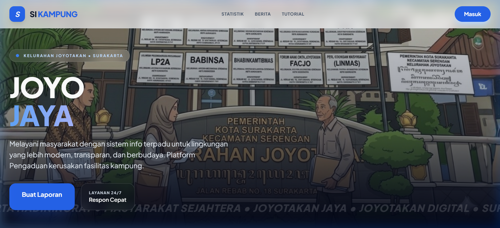
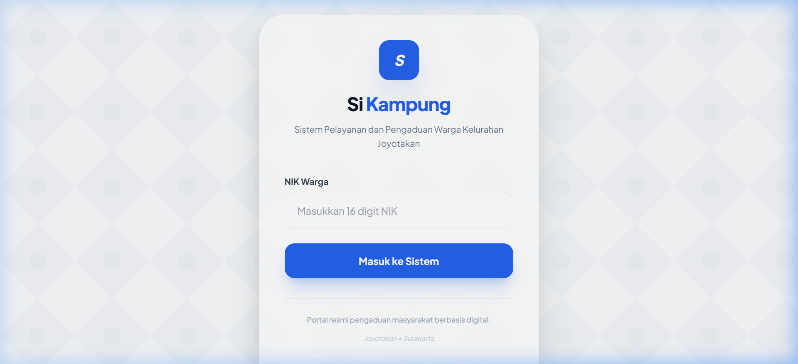
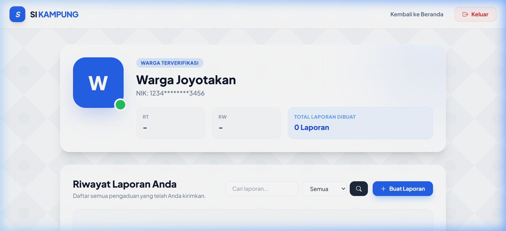
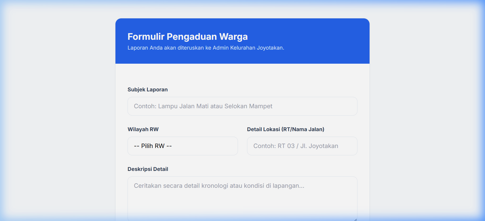
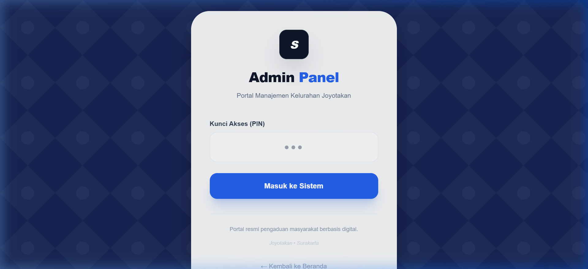
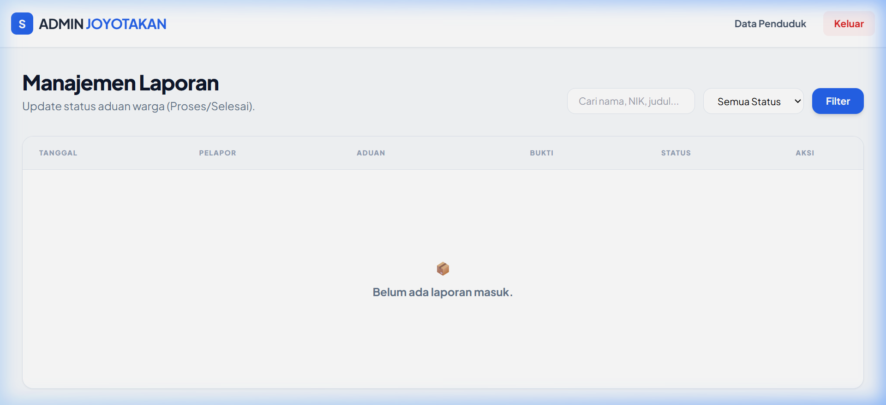
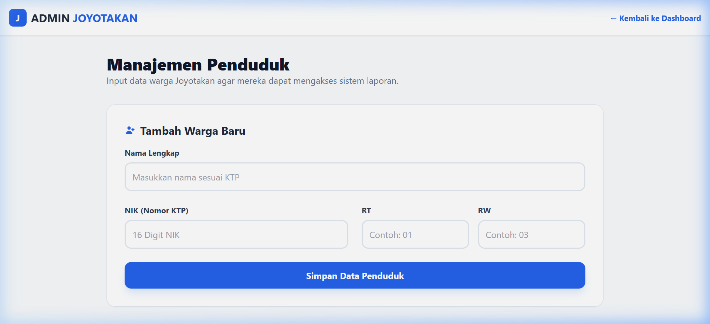
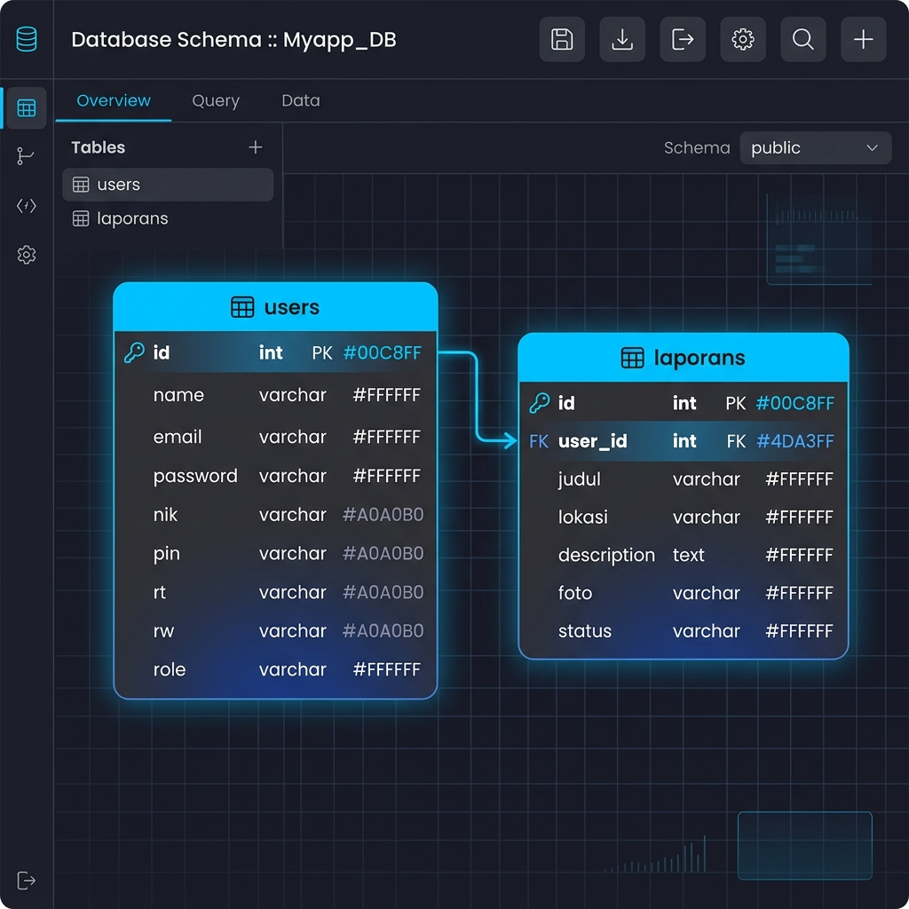

# 🏘️ SiKampung Joyotakan - Sistem Informasi & Pelayanan Warga

**SiKampung Joyotakan** adalah platform digital berbasis web yang dirancang khusus untuk memfasilitasi pelaporan keluhan warga serta manajemen data kependudukan secara efisien di Kelurahan Joyotakan. Sistem ini mempertemukan warga secara langsung dengan jajaran admin kelurahan untuk mempercepat penanganan masalah lingkungan, sosial, maupun infrastruktur.

---

## ✨ Fitur & Kelebihan Web

Sistem Informasi SiKampung didesain dengan prinsip kemudahan penggunaan (user-friendly) serta tampilan yang premium dan responsif:

1. **Autentikasi Praktis Tanpa Ribet**:
   * **Warga**: Cukup masuk menggunakan 16-digit **NIK (Nomor Induk Kependudukan)** tanpa perlu mengingat password rumit.
   * **Admin**: Masuk secara cepat menggunakan **PIN** rahasia yang aman.
2. **Statistik Real-time**: Beranda menampilkan statistik terkini laporan warga (Total Laporan, Laporan Diproses, dan Laporan Selesai).
3. **Form Pengaduan Interaktif**: Pengaduan dilengkapi dengan judul, lokasi, deskripsi rinci, serta lampiran foto bukti.
4. **Pencarian & Validasi Pintar**: Baik warga maupun admin dapat melakukan pencarian laporan dan memfilter laporan berdasarkan status (Semua, Pending, Proses, Selesai).
5. **Manajemen Akun Warga Terpadu (CRUD)**: Admin memiliki kendali penuh untuk menambah, mengedit (secara inline tanpa pindah halaman), serta menghapus akun warga secara instan.
6. **Desain Modern & Responsif**: Menggunakan Tailwind CSS dengan ornamen batik modern khas Nusantara, navigasi menu hamburger pada tampilan ponsel, serta dialog/toast interaktif yang memanjakan mata.

---

## 🛠️ Cara Menjalankan Aplikasi

Ikuti panduan langkah demi langkah di bawah ini untuk menjalankan platform di komputer lokal Anda:

### Prerequisites (Prasyarat)
* **Laragon** atau **XAMPP** (PHP >= 8.2 & MySQL)
* **Composer**
* **Node.js & NPM**

### Langkah Instalasi

1. **Clone & Masuk ke Folder Project**:
   ```bash
   git clone https://github.com/cece1329/sikampung-web.git
   cd sikampung
   ```

2. **Instal Dependensi PHP**:
   ```bash
   composer install
   ```

3. **Salin File Konfigurasi `.env`**:
   ```bash
   cp .env.example .env
   ```

4. **Generate Application Key**:
   ```bash
   php artisan key:generate
   ```

5. **Konfigurasi Database di `.env`**:
   Sesuaikan baris-baris berikut dengan setelan database lokal Anda (misalnya Laragon):
   ```env
   DB_CONNECTION=mysql
   DB_HOST=127.0.0.1
   DB_PORT=3306
   DB_DATABASE=sikampung
   DB_USERNAME=root
   DB_PASSWORD=root
   ```

6. **Migrasi Database dan Seed Data Awal**:
   Perintah ini akan membuat semua tabel yang dibutuhkan dan mengisi data akun uji coba untuk warga dan admin:
   ```bash
   php artisan migrate:fresh --seed
   ```

7. **Menghubungkan Storage Link**:
   Agar file foto keluhan warga dapat tampil di halaman web, buat symbolic link untuk direktori storage:
   ```bash
   php artisan storage:link
   ```

8. **Jalankan Aplikasi**:
   ```bash
   php artisan serve
   ```
   Buka peramban (browser) Anda lalu akses url **`http://127.0.0.1:8000`**.

---

## 🔑 Panduan Login Pengguna (Akun Demo)

Untuk keperluan pengujian, sistem telah menyediakan akun demo default berikut setelah Anda menjalankan seeder:

### 1. Login sebagai Warga (Citizen)
* **Halaman Login**: Akses menu **Masuk** di pojok kanan atas beranda atau langsung ke `http://127.0.0.1:8000/login`.
* **Kredensial**:
  * **NIK**: `1234567890123456`
* **Hak Akses**: Warga dapat membuat laporan pengaduan baru, melihat status pengaduan pribadi, dan mencari/memfilter riwayat laporan di halaman profil mereka.

### 2. Login sebagai Admin Kelurahan
* **Halaman Login**: Masuk langsung via URL khusus admin di `http://127.0.0.1:8000/admin/login`.
* **Kredensial**:
  * **PIN**: `123456`
* **Hak Akses**: Admin dapat mengakses dashboard kelurahan, mengubah status laporan (Proses ➔ Selesai), menghapus laporan, serta mengelola data kependudukan warga (Tambah, Edit, dan Hapus Warga).

---

## 💼 Sistem Manajemen

### 📈 Manajemen Pengaduan (Laporan)
Setiap keluhan warga melewati tiga tahap status yang dikendalikan oleh Admin Kelurahan:
1. **Pending**: Laporan baru masuk dan menunggu peninjauan admin.
2. **Proses**: Laporan sedang ditindaklanjuti oleh petugas kelurahan di lapangan.
3. **Selesai**: Laporan telah sukses ditangani dan diselesaikan. Warga menerima notifikasi visual yang melegakan.

### 👥 Manajemen Warga (CRUD Penduduk)
Admin kelurahan dapat melakukan manajemen data kependudukan:
* **Tambah Warga**: Menambahkan nama, NIK (16 digit), RT, dan RW. Secara otomatis sistem akan mengeset password awal dan PIN warga sama dengan NIK mereka.
* **Edit Warga**: Mengubah data profil warga secara langsung di tabel daftar warga melalui form inline editor yang dinamis.
* **Hapus Warga**: Menghapus data akun warga yang sudah tidak terdaftar di kelurahan.

---

## 📸 Screenshot Halaman Aplikasi

Berikut adalah tampilan visual antarmuka aplikasi SiKampung Joyotakan:

### 1. Halaman Beranda (Landing Page)
Menampilkan statistik keluhan warga yang real-time dengan latar belakang batik premium.


### 2. Halaman Login Warga
Tampilan login minimalis yang hanya memerlukan 16 digit NIK.


### 3. Profil & Riwayat Laporan Warga
Tempat warga melihat seluruh keluhan yang pernah dikirimkan beserta statusnya dan fitur pencarian.


### 4. Form Kirim Pengaduan Baru
Formulir pengaduan interaktif yang dilengkapi pratinjau (preview) unggahan foto.


### 5. Halaman Login Admin
Halaman login khusus bagi administrator kelurahan dengan sistem input PIN.


### 6. Dashboard Administrator Kelurahan
Pusat kontrol admin untuk memantau, mencari, memfilter, serta mengubah status keluhan warga.


### 7. Manajemen Data Kependudukan (CRUD Warga)
Halaman admin untuk mengelola (Tambah, Edit secara inline, dan Hapus) data warga terdaftar.


---

## 🗄️ Rancangan Database (ERD Diagram)

Aplikasi didukung oleh basis data relasional yang efisien. Relasi utama terjadi secara satu-ke-banyak (*One-to-Many*) antara tabel `users` dan `laporans`.



### Detail Struktur Tabel:

#### 1. Tabel `users`
Menampung data akun admin kelurahan serta data warga terdaftar.
* `id` (Primary Key, Auto Increment)
* `name` (string) - Nama lengkap warga / admin.
* `email` (string, unique, nullable) - Alamat email opsional.
* `nik` (string, unique, nullable) - NIK 16 digit untuk warga login.
* `pin` (string, nullable) - PIN rahasia untuk admin login atau sinkronisasi data.
* `rt` (string, 5) - Rukun Tetangga.
* `rw` (string, 5) - Rukun Warga.
* `role` (enum: `'admin'`, `'warga'`) - Peran pengguna dalam sistem.
* `password` (string) - Hash password default.
* `timestamps` (`created_at`, `updated_at`)

#### 2. Tabel `laporans`
Menampung seluruh pengaduan warga kelurahan.
* `id` (Primary Key, Auto Increment)
* `user_id` (Foreign Key, terhubung ke `users.id` dengan opsi *cascade on delete*) - Menunjukkan pembuat laporan.
* `judul` (string) - Judul keluhan/masalah.
* `lokasi` (string) - Alamat atau titik lokasi kejadian.
* `description` (text) - Penjelasan detail kronologi keluhan.
* `foto` (string, nullable) - Path lokasi foto bukti keluhan di server.
* `status` (enum: `'pending'`, `'proses'`, `'selesai'`) - Status penanganan aduan.
* `timestamps` (`created_at`, `updated_at`)
